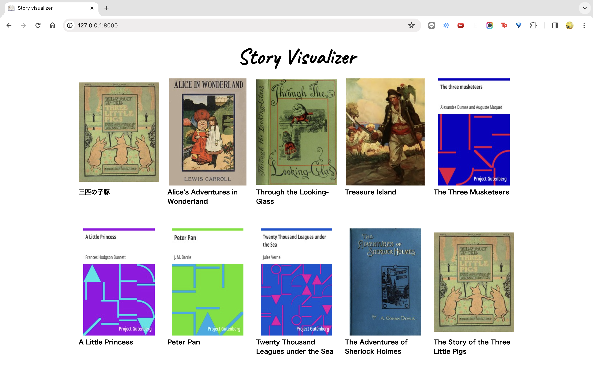
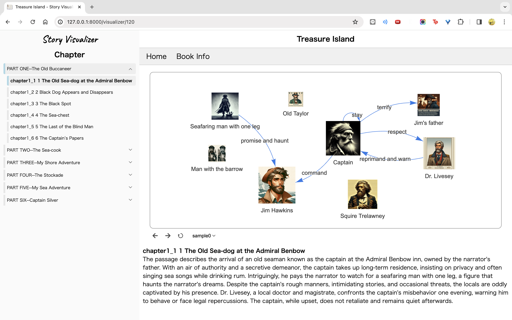
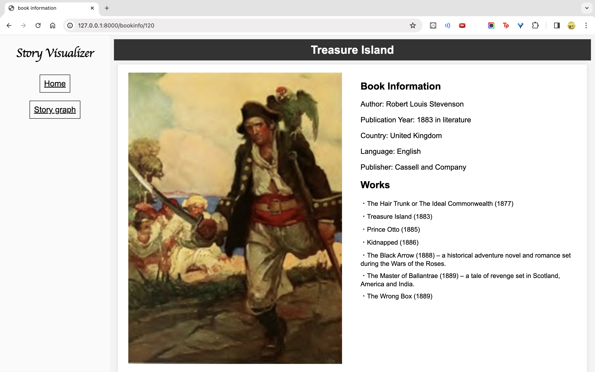

# 2023年度MM工学演習
## 物語の相関図自動生成アプリ

## 日程
| 日時                     | イベント                  | 場所         | 備考                                    |
|--------------------------|--------------------------|--------------|----------------------------------------|
| 2023年7月26日 (水) 4限    | 中間報告                  | C609         |                                        |
| 2023年12月26日 (火)       | 最終レポート提出〆         | -            | 35ページ程度, 担当教員宛に提出           |
| 2024年1月10日 (水) 5,6限  | 発表会                    | B101         | 発表35分, 質疑7分                       |

## 通信用API
### ver1
- [Document](https://docs.google.com/document/d/15GtPuwLwjd76rHHsPiepqUjR26vcZNRI9riEAbiblbc/edit)
- [Sample](sample_graph.json)
### ver2
#### 変更点（階層的な段落構造に対応した）
- 各段落ごとに要約データを作成する必要があるようになった
- titleの項目がなくなった
- sectionNameの項目が追加された
- summaryの要素がリストから文字列になった
- periodの項目がなくなった
#### 参考
- [Definition](visualizer/static/visualizer/summarized_data/README.md)
- [Sample](visualizer/static/visualizer/summarized_data/0/sample0/all_data.json)

## 進捗
- [Notion](https://www.notion.so/1e9ce39c45914aa8af0249aec049f908?v=07ba6eee0c0a42069b6605df759fce0d&pvs=4)

## 本アプリの動作方法
以下のコマンドを順に実行  
```sh
$ pip install -r Docker/requirements.txt
$ apt update
$ apt upgrade
$ python manage.py migrate
$ python manage.py runserver
```
  
 <br>

<details>
<summary>docker composeを用いる場合の本アプリの動作方法 (推奨) (2回目以降はdocker engineの起動＆3. 4. のみでよい)</summary>

0. 
```sh
$ git clone https://github.com/u109755b/mm-enshu-2023 
```

1. docker engine をインストール & docker engine を起動 (2回目以降は起動のみ)
https://docs.docker.com/engine/install/  
docker compose インストールされているかの確認(多分docker engineインストールしたらデフォで入ってる)  
```sh
$ docker-compose --version
docker-compose version 1.5.2, build 7240ff3
```

2. メインディレクトリで以下を実行 (イメージ・コンテナ作成)
```sh
$ docker-compose up -d
```

3. 以下を実行 (コンテナに入る)
```sh
$ docker container exec -it mm-enshu-2023 bash
```

4. 以下のコマンドを実行
```sh
$ python manage.py migrate
$ python manage.py runserver 0.0.0.0:8000
(docker用いる場合は本アプリの動作方法とコマンドが少し違うことに注意)
```
</details>

<br>

<details>
<summary>docker composeを用いないdockerでの本アプリの動作方法 (2回目以降はdocker engineの起動＆4. 5. のみでよい)</summary>

0. 
```sh
$ git clone https://github.com/u109755b/mm-enshu-2023 
```

1. docker をインストール & docker engine を起動 (2回目以降は起動のみ)
https://docs.docker.com/engine/install/

2. Dockerfileの置かれているディレクトリ (Docker) で以下を実行 (イメージ作成)
```sh
$ docker build -t mm-enshu .
```

3. create_graph.pyとかがあるメインディレクトリで以下を実行 (コンテナ作成)

```sh
mac/linux
$ docker run -dit -p 8000:8000 -v $(pwd):/code --name mm-enshu_test mm-enshu

Windows
$ docker run -dit -p 8000:8000 -v %cd%:/code --name mm-enshu_test mm-enshu
(上のコードでエラッたらこっち)
$ docker run -dit -p 8000:8000 -v ${pwd}:/code --name mm-enshu_test mm-enshu
```

4. 以下を実行 (コンテナに入る)
```sh
$ docker container exec -it mm-enshu_test bash
```

5. 以下のコマンドを実行
```sh
$ python manage.py migrate
$ python manage.py runserver 0.0.0.0:8000
(docker用いる場合は本アプリの動作方法とコマンドが少し違うことに注意)
```
</details>

<br>


それぞれ最後のコマンド実行時、ブラウザで以下のアドレスにアクセス  
`http://localhost:8000`  


## 本アプリのイメージ
### ホームページ

### 物語ページ

### 関連情報ページ
