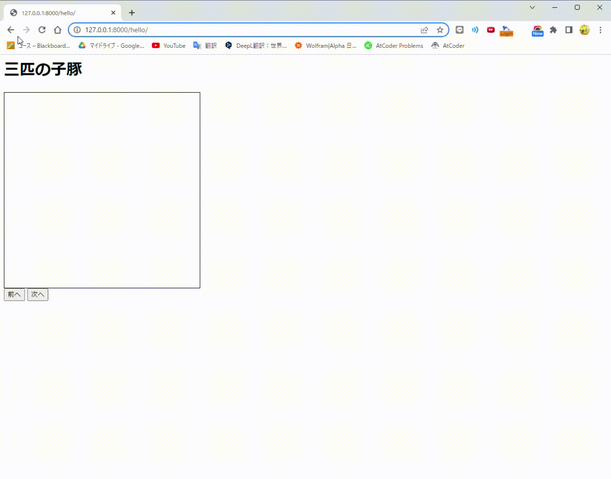

# 2023年MM工学演習
## 物語の相関図自動生成アプリの作成
### 役割分担
- NLP： 宮野、小笠
- 外部情報： 菊地、張、小野
- 可視化： 三谷、吉田

### 日程
- 定期ミーティング： 木4（15:10~16:40）
- 中間報告： 各研究室の担当教員より指示
- 最終レポート提出： 11月下旬（担当教員宛に提出）
- 発表会： 12月中旬～下旬に実施（集合形式もしくはオンラインで実施）

### 通信用API
- [document](https://docs.google.com/document/d/15GtPuwLwjd76rHHsPiepqUjR26vcZNRI9riEAbiblbc/edit)
- [sample](sample_graph.json)

### 進捗
4/27（[notion](https://ounlp.notion.site/2-4b0ec286a8cb49bfaf408b4824ec456c)）
- 役割分担を決定
- 一旦「[三匹の子豚](https://www.gutenberg.org/ebooks/18155)」を使ってアプリを作成するという方向性を決定

6/26
- graph.jsonをEdgeGPTを用いて作成できるように変更．
- dockerfileを追加 (使い方の説明はDocker/how_to_use_docker.txt・今後その他の更新に合わせて変更)

### 本アプリの動作方法
1. 以下のコマンドを順に実行  
```sh
$ pip install django
$ pip install EdgeGPT
$ python create_graph.py 三匹の子豚
$ python manage.py migrate
$ python manage.py runserver
```
2. ブラウザで以下のアドレスにアクセス  
`http://localhost:8000/visualizer`

### 本アプリの動作デモ

